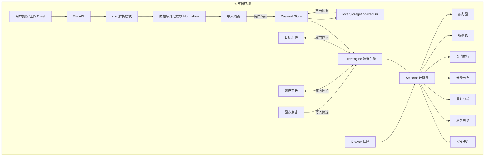
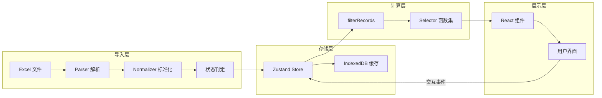
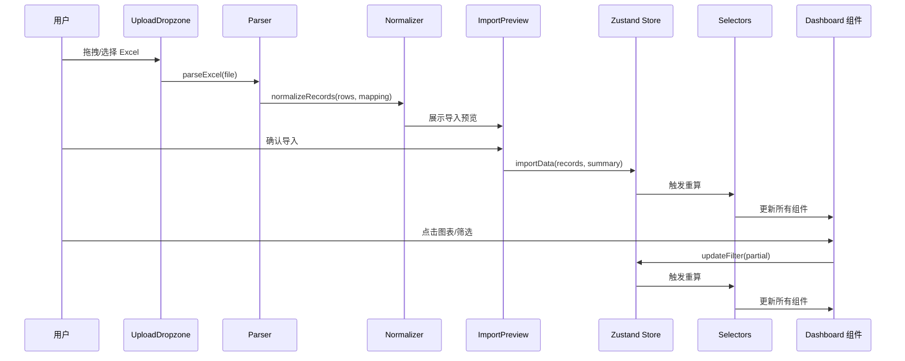

# Design Document: Game Finance Dashboard

## Overview

本设计文档描述游戏公司财务费用分析可视化平台的技术架构和实现方案。该平台是一个纯前端、全中文、可静态部署的 Excel 财务可视化工具，基于 Vite + React + TypeScript 构建。

**核心设计目标：**
- 浏览器本地解析 Excel，不依赖后端服务
- 全局筛选状态驱动所有组件联动刷新
- 支持多层级分类钻取和部门排行分析
- localStorage/IndexedDB 实现本地持久化
- 构建产物为纯静态文件，可部署到任意静态站点

**技术栈选择：**
| 层面 | 选型 | 理由 |
|------|------|------|
| 构建工具 | Vite | 快速冷启动、HMR、TypeScript 原生支持 |
| UI 框架 | React 18 + TypeScript | 组件化、类型安全、生态成熟 |
| Excel 解析 | xlsx (SheetJS) | 浏览器端 .xlsx/.xls 解析，无需后端 |
| 状态管理 | Zustand | 轻量、支持中间件、无 Provider 嵌套 |
| 图表 | ECharts | 支持半环图、热力图、趋势图，可自定义主题 |
| 日期工具 | date-fns | 轻量、tree-shakable、不可变操作 |
| 持久化 | localStorage + IndexedDB (idb-keyval) | 视图存 localStorage，大数据存 IndexedDB |

## Architecture

### 系统架构图



### 数据流架构



### 模块职责划分

| 模块 | 职责 | 输入 | 输出 |
|------|------|------|------|
| Parser | 读取 Excel、识别表头、映射字段 | File 对象 | 原始行数据 + 字段映射 |
| Normalizer | 日期/币种/金额标准化、状态判定 | 原始行数据 | ExpenseRecord[] |
| FilterEngine | 管理全局筛选状态、处理联动逻辑 | 用户交互事件 | FilterState |
| Selectors | 基于筛选状态派生聚合结果 | ExpenseRecord[] + FilterState | KPI/趋势/分布等 |
| Components | 渲染可视化组件、响应用户交互 | Selector 结果 | DOM + 事件 |
| Persistence | localStorage/IndexedDB 读写 | 视图/数据 | 缓存/恢复 |

## Components and Interfaces

### 目录结构

```
src/
├── App.tsx                         # 应用入口、路由/状态初始化
├── types/
│   ├── expense.ts                  # ExpenseRecord、FilterState 类型
│   └── chart.ts                    # 图表数据类型
├── data/
│   ├── parser.ts                   # Excel 解析、表头识别
│   ├── normalizer.ts               # 数据标准化
│   ├── headerAliases.ts            # 表头别名映射表
│   └── selectors.ts                # 所有计算/聚合函数
├── state/
│   ├── store.ts                    # Zustand store 定义
│   ├── filterActions.ts            # 筛选状态变更 actions
│   └── persistence.ts             # localStorage/IndexedDB 持久化
├── utils/
│   ├── dateUtils.ts                # 日期工具函数
│   ├── currencyUtils.ts            # 币种/金额显示函数
│   └── constants.ts                # 常量定义（默认汇率等）
├── components/
│   ├── Layout.tsx                  # 整体布局（左导航+中内容+右日历）
│   ├── UploadDropzone.tsx          # 拖拽/点击上传区域
│   ├── ImportPreview.tsx           # 导入预览确认
│   ├── FilterPanel.tsx             # 筛选面板
│   ├── FilterTags.tsx              # 筛选标签区
│   ├── CalendarPanel.tsx           # 日历筛选组件
│   ├── KpiCards.tsx                # KPI 总览卡片
│   ├── TrendOverview.tsx           # 费用趋势总览
│   ├── CumulativeAnalysis.tsx      # 累计分析
│   ├── CategoryDistribution.tsx    # 费用结构分布（半环图）
│   ├── CategoryDrill.tsx           # 分类钻取
│   ├── DepartmentRanking.tsx       # 部门排行
│   ├── DepartmentDetail.tsx        # 部门费用详情
│   ├── ExpenseTable.tsx            # 明细表
│   ├── Heatmap.tsx                 # 费用热力图
│   ├── DetailDrawer.tsx            # 右侧抽屉
│   └── SavedViews.tsx              # 保存筛选视图
└── theme/
    └── echarts.ts                  # ECharts 自定义主题
```

### 核心接口定义

#### Parser 模块

```typescript
// data/parser.ts
interface ParseResult {
  success: boolean;
  rows: RawRow[];
  fieldMapping: FieldMapping;
  errors: ParseError[];
}

interface FieldMapping {
  [standardField: string]: string; // standardField -> 实际列名
}

interface ParseError {
  type: 'missing_header' | 'invalid_format' | 'no_valid_headers';
  message: string; // 中文错误信息
}

function parseExcel(file: File): Promise<ParseResult>;
function recognizeHeaders(headerRow: string[]): FieldMapping;
```

#### Normalizer 模块

```typescript
// data/normalizer.ts
interface NormalizeResult {
  records: ExpenseRecord[];
  summary: ImportSummary;
}

interface ImportSummary {
  totalRows: number;
  normalRows: number;
  pendingClassifyRows: number;
  abnormalRows: number;
  fieldMapping: FieldMapping;
}

function normalizeRecords(
  rows: RawRow[], 
  mapping: FieldMapping, 
  config: ImportConfig
): NormalizeResult;

function determineImportStatus(record: Partial<ExpenseRecord>): ImportStatus;
```

#### FilterEngine / Store

```typescript
// state/store.ts
interface AppState {
  // 数据
  records: ExpenseRecord[];
  importSummary: ImportSummary | null;
  
  // 筛选
  filter: FilterState;
  
  // UI 状态
  drawerOpen: boolean;
  drawerContext: DrawerContext | null;
  importPhase: 'idle' | 'parsing' | 'preview' | 'dashboard';
  
  // Actions
  importData: (records: ExpenseRecord[], summary: ImportSummary) => void;
  updateFilter: (partial: Partial<FilterState>) => void;
  resetFilter: () => void;
  clearTimeFilter: () => void;
  openDrawer: (context: DrawerContext) => void;
  closeDrawer: () => void;
}
```

#### Selectors

```typescript
// data/selectors.ts
function filterRecords(records: ExpenseRecord[], state: FilterState): ExpenseRecord[];
function getKpis(records: ExpenseRecord[], state: FilterState): KpiResult;
function getTrendData(records: ExpenseRecord[], state: FilterState): TrendPoint[];
function getCumulativeData(records: ExpenseRecord[], state: FilterState): CumulativePoint[];
function getCategoryDistribution(records: ExpenseRecord[], state: FilterState): CategoryDistributionItem[];
function getDepartmentRanking(records: ExpenseRecord[], state: FilterState): DepartmentAmount[];
function getDepartmentDetail(records: ExpenseRecord[], state: FilterState): DepartmentDetail;
function getTableRows(records: ExpenseRecord[], state: FilterState): ExpenseRecord[];
function getHeatmapData(records: ExpenseRecord[], state: FilterState): HeatmapCell[][];
```

#### 日期工具

```typescript
// utils/dateUtils.ts
function getDefaultTrendGrain(state: FilterState): TrendGrain;
function getDateWindow(state: FilterState, records: ExpenseRecord[]): { start: string; end: string };
function getCumulativeGrain(state: FilterState): 'day' | 'week' | 'month';
function parseDateValue(value: unknown): string | null;
function monthRange(start: string, end: string): string[];
function dateRange(start: string, end: string): string[];
function quarterRange(start: string, end: string): QuarterBucket[];
```

#### 币种工具

```typescript
// utils/currencyUtils.ts
function displayMoney(amountCNY: number, currencyMode: CurrencyMode, usdRate: number): string;
function convertToDisplayCurrency(amountCNY: number, mode: CurrencyMode, rate: number): number;
```

### 组件交互流程



## Data Models

### ExpenseRecord（费用记录）

```typescript
interface ExpenseRecord {
  id: string;                    // 唯一 ID: `${importBatchId}-${sourceRowNo}`
  date: string;                  // 交易日期 YYYY-MM-DD
  amount: number;                // 原币金额
  amountCNY: number;             // 本位币金额（人民币）
  currency: 'RMB' | 'USD';      // 交易原币种
  exchangeRate: number;          // 汇率
  categoryL1: string;            // 一级分类
  categoryL2: string;            // 二级分类
  categoryL3: string;            // 三级分类
  categoryExtra: string;         // 辅助分类
  department: string;            // 部门/项目
  person: string;                // 主体/公司实体
  bankAccount: string;           // 银行账户
  periodMonth: string;           // 期间 YYYY-MM
  transactionType: TransactionType;  // 交易类型
  importStatus: ImportStatus;    // 导入状态
  sourceRowNo: number;           // Excel 原始行号
  rawFields?: Record<string, unknown>; // 未映射字段缓存
}

type TransactionType = 'expense' | 'income' | 'intercompany' | 'unclassified';
type ImportStatus = 'normal' | 'pending_classify' | 'abnormal';
type CurrencyMode = 'CNY' | 'USD';
type TrendGrain = 'year' | 'quarter' | 'month' | 'day';
```

### FilterState（筛选状态）

```typescript
interface FilterState {
  period: string;          // '' | 'YYYY' | 'YYYY-MM'
  date: string;            // '' | 'YYYY-MM-DD'
  dateStart: string;       // 日期区间开始
  dateEnd: string;         // 日期区间结束
  person: string;
  department: string;
  categoryL1: string;
  categoryL2: string;
  categoryL3: string;
  bankAccount: string;
  currency: '' | 'RMB' | 'USD';
  importStatus: '' | 'normal' | 'pending_classify' | 'abnormal';
  currencyMode: CurrencyMode;  // 展示口径
  trendGrain: TrendGrain | '';  // 趋势粒度
  trendManual: boolean;         // 是否用户手动设置粒度
}
```

### 聚合结果类型

```typescript
interface KpiResult {
  confirmedExpense: number;
  rawAmount: number;
  pendingAmount: number;
  peakAmount: number;
  peakMonth: string;
}

interface TrendPoint {
  label: string;
  amount: number;
  bucket: string;
}

interface CumulativePoint {
  label: string;
  amount: number;
  cumulative: number;
}

interface CategoryDistributionItem {
  categoryL1: string;
  amount: number;
  share: number;
}

interface DepartmentAmount {
  department: string;
  amount: number;
}

interface DepartmentDetail {
  department: string;
  totalAmount: number;
  recordCount: number;
  trend: TrendPoint[];
  topRecords: ExpenseRecord[];
}

interface HeatmapCell {
  row: string;
  col: string;
  value: number;
  level: 0 | 1 | 2 | 3;
}

interface DrawerContext {
  type: 'kpi' | 'trend' | 'category' | 'department' | 'detail' | 'heatmap';
  title: string;
  amount: number;
  recordCount: number;
  maxSingle: number;
  topCategories: { name: string; amount: number }[];
  topDepartments: { name: string; amount: number }[];
  topRecords: ExpenseRecord[];
}

interface SavedView {
  id: string;
  name: string;
  state: FilterState;
  createdAt: string;
}

interface ImportConfig {
  defaultUsdRate: number;
  importBatchId: string;
}
```

### 表头别名映射

```typescript
const HEADER_ALIASES: Record<string, string[]> = {
  date: ['日期', '交易日期', '记账日期', 'date'],
  amount: ['原币金额', '金额', '借方金额', '贷方金额', 'amount'],
  amountCNY: ['本位币金额', '人民币金额', '折人民币', 'amountCNY'],
  currency: ['币种', '货币', 'currency'],
  exchangeRate: ['汇率', 'exchangeRate'],
  categoryL1: ['一级分类', '费用大类', 'categoryL1'],
  categoryL2: ['二级分类', '费用分类', 'categoryL2'],
  categoryL3: ['三级分类', '明细分类', 'categoryL3'],
  categoryExtra: ['辅助分类', '标签', 'categoryExtra'],
  department: ['部门', '项目', '部门/项目', 'department'],
  person: ['主体', '公司', '公司主体', 'person'],
  bankAccount: ['银行账户', '账户', 'bankAccount'],
  periodMonth: ['期间', '月份', 'periodMonth'],
  transactionType: ['交易类型', '收支类型', 'transactionType'],
};
```

## Correctness Properties

### Property 1: Header Alias Recognition

*For any* header row containing one or more known aliases (from HEADER_ALIASES mapping), the recognizeHeaders function SHALL map each alias to its correct standard field name, and the resulting mapping SHALL contain an entry for every recognized alias.

**Validates: Requirements 2.1, 2.2, 2.3, 2.4**

### Property 2: Date Normalization Round-Trip

*For any* valid calendar date represented as an Excel serial number, YYYY/MM/DD string, or YYYY-MM-DD string, the parseDateValue function SHALL produce a valid YYYY-MM-DD string representing the same calendar date, and the resulting periodMonth SHALL equal the first 7 characters of the normalized date.

**Validates: Requirements 3.1, 3.2**

### Property 3: Currency Alias Normalization

*For any* currency value that is one of 'RMB', 'CNY', '人民币', 'USD', or '美元', the Normalizer SHALL produce either 'RMB' (for RMB/CNY/人民币) or 'USD' (for USD/美元), and no other output values are possible for valid inputs.

**Validates: Requirements 3.3, 3.4**

### Property 4: AmountCNY Computation

*For any* record where amountCNY is not provided in the source data, the Normalizer SHALL compute amountCNY as amount × exchangeRate, and the absolute difference between the computed value and the stored value SHALL be less than 0.001.

**Validates: Requirements 3.7**

### Property 5: Import Status Determination

*For any* record, the importStatus SHALL be determined as follows: if date is valid AND amount is a valid number AND currency is RMB or USD AND periodMonth is valid AND categoryL1 is not '未分类', then status is 'normal'; if amount is valid but classification or department is missing, then status is 'pending_classify'; if date is invalid OR amount is not a number OR currency is unsupported OR (currency is USD and no exchange rate available) OR (amountCNY provided and |amountCNY - amount×exchangeRate| > 0.01), then status is 'abnormal'.

**Validates: Requirements 4.1, 4.2, 4.3, 4.4, 4.5**

### Property 6: Filter Time Priority

*For any* set of ExpenseRecords and FilterState, the filterRecords function SHALL apply time filters in priority order: (1) if date is set, only records with matching date pass; (2) else if dateStart/dateEnd are set, only records within the range pass; (3) else if period is set (YYYY or YYYY-MM), only records matching the period pass. At no point SHALL a lower-priority time filter override a higher-priority one.

**Validates: Requirements 5.3, 5.4, 5.5**

### Property 7: Filter Reset Invariants

*For any* FilterState with time fields set, calling clearTimeFilter SHALL produce a state where period, date, dateStart, and dateEnd are all empty strings, and trendManual is false.

**Validates: Requirements 6.4, 6.5**

### Property 8: Currency Display Formatting

*For any* non-negative amountCNY value and valid USD exchange rate, displayMoney SHALL return a string matching the format "X.X万" when currencyMode is CNY, or "$X.X万" when currencyMode is USD (where the USD value equals amountCNY ÷ rate), and the numeric value in the string SHALL be within 0.1 of the expected value.

**Validates: Requirements 7.1, 7.2**

### Property 9: Currency Filter Correctness

*For any* set of ExpenseRecords containing both RMB and USD transactions, when the currency filter is set to 'RMB', all returned records SHALL have currency='RMB'; when set to 'USD', all returned records SHALL have currency='USD'; when currency filter is empty, records of both currencies SHALL be included.

**Validates: Requirements 7.3, 7.4**

### Property 10: KPI Calculation Invariants

*For any* set of filtered ExpenseRecords: (1) confirmedExpense SHALL equal the sum of amountCNY where transactionType='expense' AND importStatus='normal'; (2) rawAmount SHALL equal the sum of all records' amountCNY; (3) pendingAmount SHALL equal the sum of amountCNY where importStatus!='normal' OR categoryL1='未分类'; (4) peakAmount SHALL equal the maximum value when records are grouped by periodMonth and summed; (5) confirmedExpense + pendingAmount SHALL be ≤ rawAmount.

**Validates: Requirements 8.1, 8.2, 8.3, 8.4**

### Property 11: Trend Grain Auto-Selection

*For any* FilterState, getDefaultTrendGrain SHALL return: 'month' when period matches YYYY (year); 'day' when period matches YYYY-MM (month) or when date is set; the appropriate grain based on interval length when dateStart/dateEnd are set (day for ≤31 days, month for ≤365 days, quarter for longer); 'month' when no time filter is set.

**Validates: Requirements 9.1, 9.2, 9.3, 9.4**

### Property 12: Cumulative Grain Selection

*For any* FilterState, getCumulativeGrain SHALL return: 'month' when period is a year; 'day' when period is a month or date is set; 'day' when date range ≤ 62 days; 'week' when range is 63–190 days; 'month' when range > 190 days. Additionally, for any cumulative data series, the volatility calculation (max-min)/max×100% SHALL produce a value between 0 and 100 inclusive.

**Validates: Requirements 10.1, 10.2, 10.3, 10.4, 10.5, 10.6, 10.7**

### Property 13: Category Distribution Invariants

*For any* set of ExpenseRecords and FilterState, getCategoryDistribution SHALL: (1) compute distribution based on all filters EXCEPT categoryL1/L2/L3; (2) produce shares that sum to approximately 1.0 (±0.001) when records exist; (3) include every distinct categoryL1 value present in the filtered base; (4) each item's amount SHALL be non-negative.

**Validates: Requirements 11.1, 11.3**

### Property 14: Department Ranking Sort Order

*For any* set of ExpenseRecords and FilterState, getDepartmentRanking SHALL return departments sorted in strictly non-increasing order by amount, computed using all filters EXCEPT department.

**Validates: Requirements 13.1**

### Property 15: Saved View Persistence Round-Trip

*For any* valid FilterState, saving it as a view and then loading it back SHALL produce a FilterState that is deeply equal to the original. Additionally, the saved views count SHALL never exceed 6 regardless of how many save operations are performed.

**Validates: Requirements 18.1, 18.2, 18.3**

### Property 16: Data Cache Round-Trip

*For any* array of valid ExpenseRecords, storing them to IndexedDB and loading them back SHALL produce an array that is deeply equal to the original (same length, same field values for every record).

**Validates: Requirements 23.1, 23.4**

## Error Handling

### 导入错误处理策略

| 错误场景 | 检测位置 | 处理方式 | 用户提示 |
|---------|---------|---------|---------|
| 文件格式错误 | UploadDropzone | 阻止进入解析流程 | 「文件格式不支持，请导入 .xlsx 或 .xls 文件」 |
| 无有效表头 | Parser.recognizeHeaders | 返回错误，阻止继续 | 「未识别到有效表头，请检查第一行是否为字段名称」 |
| 缺少日期字段 | Parser.recognizeHeaders | 返回错误 | 「缺少交易日期字段，请检查 date/交易日期/日期 列」 |
| 缺少金额字段 | Parser.recognizeHeaders | 返回错误 | 「缺少金额字段，请检查 amount/原币金额/金额 列」 |
| 全部行异常 | Normalizer 统计 | 阻止进入仪表盘 | 「没有可分析的数据，请检查日期、金额、币种和汇率」 |
| 单行数据异常 | Normalizer.determineStatus | 标记 abnormal 但不中断 | 预览中展示异常行数 |
| localStorage 满 | persistence.saveView | try-catch 降级 | 「保存失败，本地存储空间不足」 |
| IndexedDB 不可用 | persistence.cacheData | 降级为不缓存 | 不提示，静默降级 |
| Excel 文件损坏 | xlsx 库抛错 | catch 并提示 | 「文件解析失败，请确认文件未损坏」 |

### 错误边界策略

```typescript
// 组件级错误边界
class ChartErrorBoundary extends React.Component {
  // 单个图表渲染失败不影响其他组件
  // 显示「该组件加载失败，请刷新重试」
}

// 数据层防御
function safeSelector<T>(selector: () => T, fallback: T): T {
  try { return selector(); }
  catch { return fallback; }
}
```

### 数据校验规则

- **日期校验**: 解析后验证年份在 1900-2100 范围内，月份 1-12，日期合法
- **金额校验**: 必须为有限数字（非 NaN、非 Infinity），允许负数（贷方）
- **汇率校验**: 必须为正数且在合理范围（0.001 ~ 10000）
- **容忍值**: amountCNY 与计算值的允许偏差 ≤ 0.01

## Testing Strategy

### 测试框架选型

| 层面 | 工具 | 用途 |
|------|------|------|
| 单元测试 | Vitest | 快速、Vite 原生集成 |
| Property-Based Testing | fast-check | TypeScript PBT 库，与 Vitest 集成 |
| 组件测试 | @testing-library/react | 组件交互测试 |
| E2E 测试 | 可选 Playwright | 全流程验收（非首版必需） |

### Property-Based Testing 配置

- 库: `fast-check`
- 每个 property test 最少运行 **100 次迭代**
- 每个 test 文件标注对应的 design property
- 标注格式: `// Feature: game-finance-dashboard, Property {N}: {title}`

### 测试分层

**Property Tests（核心逻辑验证）:**
- `parser.property.test.ts` — 表头识别 (Property 1)
- `normalizer.property.test.ts` — 日期标准化 (Property 2)、币种标准化 (Property 3)、金额计算 (Property 4)、状态判定 (Property 5)
- `filter.property.test.ts` — 时间优先级 (Property 6)、重置 (Property 7)、币种过滤 (Property 9)
- `currency.property.test.ts` — 金额显示 (Property 8)
- `selectors.property.test.ts` — KPI (Property 10)、趋势粒度 (Property 11)、累计粒度 (Property 12)、分类分布 (Property 13)、部门排行 (Property 14)
- `persistence.property.test.ts` — 视图存取 (Property 15)、数据缓存 (Property 16)

**Unit Tests（示例与边界）:**
- 文件类型验证（.csv, .txt 等被拒绝）
- 默认值填充（department 缺失→未分配部门）
- 空状态处理
- KPI 点击交互
- 趋势柱点击映射

**Integration Tests:**
- 筛选面板 ↔ 日历双向同步
- 图表点击 → 筛选状态 → 全页刷新
- 导入 → 预览 → 仪表盘完整流程
- Drawer 打开/关闭生命周期

**Smoke Tests:**
- `npm run build` 产物无后端依赖
- 初始页面显示上传引导（中文）
- localStorage 可读写
- 全中文 UI 验证（无英文导航项）
